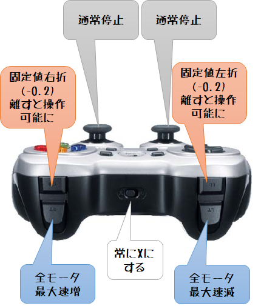

# Automotive forklift jones for donkeycar

## 操作方法

- 最初に運転する場合、`data`ディレクトリを作成しているか確認する（ないとエラーになる）
- `python manage.py drive` 実行時初期動作モードは user（完全手動運転）
- 運転モード変更ボタンを押すたびに、local_angle（操舵のみ自動）、local（完全自動運転）、user（完全手動運転）..と変更される
- アナログスティックを押し込むと「通常停止」となる

- 最高速の変更は３つのモータすべてに反映される

## ハードウェア

- タミヤ楽しい工作シリーズ フォークリフト
- Raspberry Pi 3B+/armv7l
- Wide Angle Pi Camera/専用カメラIF
- 32GB micro SDカード
- Marvelmind モバイルルータ(USB接続)
- Logitech F710 ワイヤレスゲームパッド(USBドングル経由)
- 単3×4 電池ボックス２個（＋電池）

### TB6612B モータ側配線

|TB6612B|コネクタ|DCモータ|備考|
|:-----|:------|:-------|:---|
|1台目|A01|正しく老いたときの右モータ赤（上）| |
|1台目|A02|正しく老いたときの右モータ白（下）| |
|1台目|B01|正しく老いたときの左モータ赤（上）| 輪っかあり |
|1台目|B02|正しく老いたときの左モータ白（下）| 輪っかあり |
|2台目|A01|正しく老いたときのリフトモータ黃（左）| |
|2台目|A02|正しく老いたときのリフトモータ青（右）| |
|2台目|B01| N/A | |
|2台目|B02| N/A | |

### TB6612B Raspberry Pi側配線

|TB6612B|基板ピン|Piピン| 定数 | 備考 |
|:---|:----|:----|:--|:--|
|1台目|PWMA|GPIO 16| RIGHT_MOTOR_PWM_GPIO |pigpio 疑似PWM |
|1台目|AIN2|GPIO 20| RIGHT_MOTOR_IN2_GPIO | pigpio出力 |
|1台目|AIN1|GPIO 21| RIGHT_MOTOR_IN1_GPIO | pigpio出力 |
|1台目|VCC|5V| N/A | 基板用電源 |
|1台目|STBY|N/A| N/A | 基板上JP1ショートで代行 |
|1台目|GND|GND| N/A | 基板用0V |
|1台目|BIN1|GPIO 13| LEFT_MOTOR_IN1_GPIO | pigpio出力 |
|1台目|BIN2|GPIO 19| LEFT_MOTOR_IN2_GPIO | pigpio出力 |
|1台目|PWMB|GPIO 26| LEFT_MOTOR_PWM_GPIO | pigpio 疑似PWM |
|2台目|PWMA|GPIO 17| LIFT_MOTOR_PWM_GPIO | pigpio 疑似PWM |
|2台目|AIN2|GPIO 27| LIFT_MOTOR_IN2_GPIO| pigpio出力 |
|2台目|AIN1|GPIO 22| LIFT_MOTOR_IN1_GPIO| pigpio出力 |
|2台目|PWMB| N/A | N/A | |
|2台目|BIN2| N/A | N/A | |
|2台目|BIN1| N/A | N/A | |

## ソフトウェア

- Praspbean OS Stretch
 - git/pigpiod/python3/virtualenv
- env (virtualenv cp35)
 - tesnorflow 1.14.0/tf lite 1.14.0
 - donkeycar 3.1.0
 - AWSIoTPythonSDK, crmod, pigpio, pyyaml, pyserial

### リポジトリ

- https://github.com/coolerking/jones3.git

>  [MITライセンス](./LICENSE)準拠

## コミュニケーションサーバ

- AWS IoT Core(AP東京リージョン)

## 調整

本リポジトリには、両モータの駆動力の差を調整するためのプログラムを用意している。

- 4秒直進できる位置にフォークリフトを置く
- `python calibrate.py` でウィザードが起動
  - 右に曲がる場合、左の駆動力が高いので `left_balance` 値を下げる
  - 左に曲がる場合、右の駆動力が高いので `right_balance` 値を下げる
- 両バランス値を確定させたらmyconfig.pyの値を変更する

## モデル

| **`model_type`** | **クラス** | **概要** |
|:--|:--|:--|
| `tflite_linear` | `donkeycar.parts.tflite.TFLitePilot` | TensorFlow Lite モデルファイルをロードして実行するためのパーツクラス。トレーニングを実行するための`compile`メソッドが実装されていないので。モデル作成およびトレーニングはdonkeycarアプリケーション外で各自で作成・実行しなくてはならない。TensorFlow Lite モデルファイルは学習済みのTensorflow用のモデルファイルを一旦作成し、それをTensorflow Liteでコンバートして作成する(h5ファイルのコンバート処理は`keras_model_to_tflite`メソッドが提供されている)。使用可能なモデルは、入力はイメージ(120x160x3)、出力はアングル値・ステアリング値（ともにfloat値）が前提となる。 |
| `localizer` | `donkeycar.parts.KerasLocalizer` | ほぼ`categorical`のモデルと同じだが、出力層がスロットル、アングルにロケーション分類値が加わっている。ロケーション分類値は、LED表示に使用されるのみなので、自動運転動作には全く影響しない。LEDを搭載していない標準DonkeyCarの場合は`categorical`を指定した場合と何ら変わらない。 しかしTubデータにロケーション分類値を格納する処理が実装されていないので、学習処理が動かないかもしれない。 |
| `behavior` | `donkeycar.parts.keras.KerasBehavioral` | 入力層がイメージと車線状態を取り込むモデル。車線状態（左車線・右車線のどちらか）をL1キーでトグル入力させそれをone hotな動作ベクトルに変換し、イメージと一緒に入力層に与えている。入力層以外はイメージ側は`categorical`と同様、状態ベクトル側は全結合層×3、最後に両方の結果を連結している。ソースコードコメントを読むと昔は`linear`ベースだったようだ。ジョイスティックがない場合、あってもL1というラベルが使用しているJoystickクラスに定義されていない場合はこのモデルを選択しても意味がない。しかも手動運転時の運転者が走行操作と並行してただしく状態を入力しなければならない。 |
| `imu` | `donkeycar.parts.keras.KerasIMU` | MPU6050(I2C)から角速度3軸、加速度3軸がTubデータに書かれていることが前提。入力層はイメージとIMU値、中間層はイメージがConv×5層・IMUが全結×3層を結合したもの、出力層でステアリング値、スロットル値を直接出力。 |
| `linear` | `donkeycar.parts.keras.KerasLinear` | donkeycarデフォルトのモデル。中間層は、Conv2D×5層。出力層でステアリング値、スロットル値を直接出力。 |
| `tensorrt_linear` | `donkeycar.parts.tensorrt.TensorRTLinear` | TensorRTを使ったクラス、このためTelsa/Jetson/Nvidia Driveがない場合は使用できない(GeForceも実行できない)。`compile`メソッドは存在するが処理が実装されていないため、学習済みモデルをロードし推論するのみの機能提供となる。なお、コメントにtesnorflow-gpuでのトレーニングは非推奨との記述がある。 |
| `coral_tflite_linear` | `donkeycar.parts.coral.CoralLinearPilot` | EdgeTPU搭載した環境を前提としたクラス。Tensorflow Liteモデルファイルを読み込み、推論を実行するのみ。モデルファイルは別途作成する必要がある。 |
| `3d` | `donkeycar.parts.keras.Keras3D_CNN` | 畳み込み層を時系列データを扱うためConv2DではなくConv3Dを使ったモデル。直近一定数（デフォルトは20）のイメージを入力し、Conv3D×４層の中間層にかけ、アングル値・スロットル値を出力する（分類ではなくfloat値で返却）。 |
| `rnn` | `donkeycar.parts.keras.KerasRNN_LSTM` | 時系列データが扱えるRNN/LSTMをベースとしたモデル。直近一定件数（デフォルトは3）のイメージを入力し、各イメージにConvolution2D×5層にかけ各々をベクトル化したものを作成しLSTM(RNN実装の一つ)にかけ、出力層はアングル値、スロットル値を出力する（分類ではなくfloat値で返却）。 |
| `categorical` | `donkeycar.parts.keras.KerasCategorical` | 画像分類を使ったモデル。入力層はイメージ、中間層はイメージサイズによりConv2D×4or5層、出力層はスロットル15分割、アングル20分割の各1値を選定する。CNNの画像分類精度の高さを使っているためlinearより精度が高いという人もいる。細やかな動作を行いたい場合は出力層の分割数を増やせば良い。 |
| `latent` | `donkeycar.parts.keras.KerasLatent` | Conv2D×8層を中間層に持つモデル。入力はイメージ、出力はアングル値・スロットル値（ともにfloat値を直接出力）以外にCNNを掛けた直後Deconvolution(Transposed Convolution/up-convolutionともいうDC-GANによく使用される)層を6層かけてイメージも生成している。しかし出力ではアングル値・スロットル値のみを使っているだけで生成したイメージは`KerasLatent`クラス内で捨てているため、そのまま使用する場合は、単にCNN8層のモデルでしかない。 |
| `fastai` | `donkeycar.parts.fastai.FastAiPilot` | fastaiパッケージのモデルファイルを読み込み実行するための推論のみのパーツクラス。クラス上に`compile`メソッドがなく`python manage.py train`を実行できない（donkeycarアプリケーションを使ったトレーニングができない）。よってモデルはdonkeycarアプリケーション外部で定義されていることが前提となる。fastaiパッケージがtoachパッケージベースで記述されているためtensorflowベースではない。なおfastaiパッケージはディープラーニングのeラーニングコースである [course.fast.ai](https://course.fast.ai/) 内で使用されている。 |
